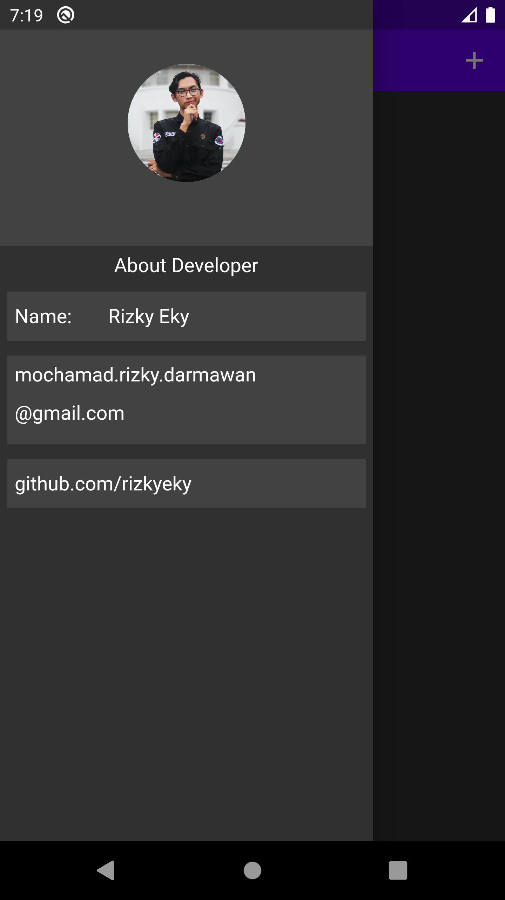

# MyWallet-Flutter

My Wallet App is my first app build by Flutter.
Manage your many wallet from this app.

## Libraries or Dependencies

  - provider (for State Management)
  - intl (for Currency Format)
  - shared_preferences (for Local Database)

## Install to your device
select one of them 
  - For arm64 [MyWallet](https://github.com/rizeky/MyWallet-Flutter/build/app/outputs/apk/release/app-arm64-v8a-release.apk)
  - For arm32 [MyWallet](https://github.com/rizeky/MyWallet-Flutter/build/app/outputs/apk/release/app-armeabi-v7a-release.apk)
  - For x86-64 [MyWallet](https://github.com/rizeky/MyWallet-Flutter/build/app/outputs/apk/release/app-x86_64-release.apk)

## Screenshots

